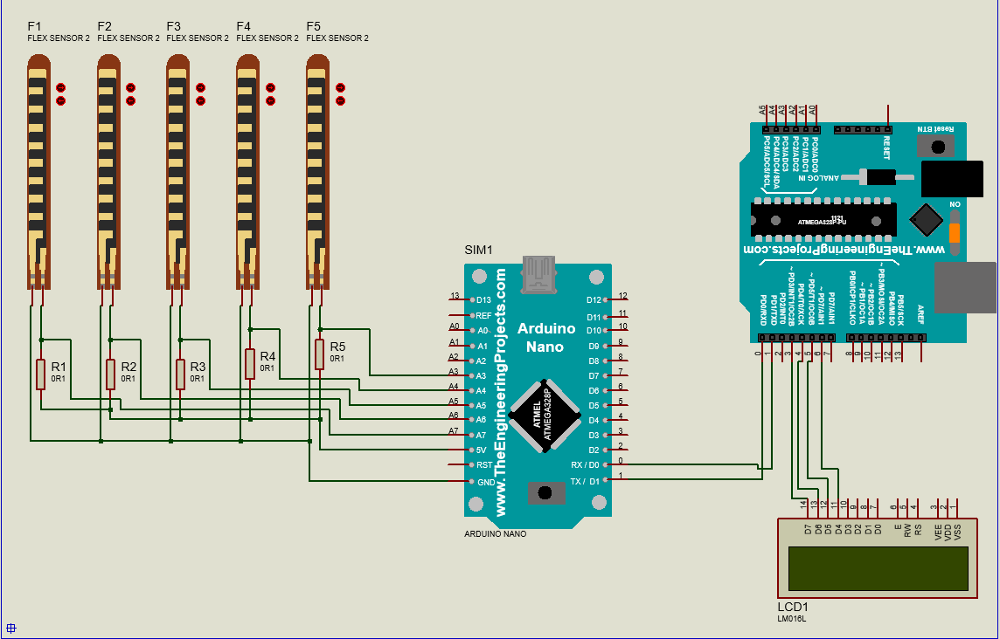

# Rapport Hebdomadaire N°1 - Prototypage sur Proteus  
_04/11/2024_

## Introduction
Cette première phase du projet a pour objectif de réaliser une simulation fonctionnelle du circuit électronique sur Proteus. Le circuit comprend des flex sensor, des résistances, un gyroscope, un Arduino Nano, un Arduino UNO, et un écran LCD. La communication entre les deux microcontrôleurs sera initialement filaire, avec une transition prévue vers Bluetooth lors des phases ultérieures. Cette étape permet de valider la conception théorique avant le montage physique.

## Objectifs
L'objectif principal ici est de réaliser un schéma de simulation complet, de vérifier la communication entre les composants (communication entre les deux arduinos - NANO et UNO) et de tester le traitement des données des flex sensor et leur affichage sur l’écran LCD.

## Activités réalisées

### Recensement du matériel
Nous avons sélectionné les composants nécessaires pour le prototype. Les **flex sensor** ont été choisis pour détecter les variations de courbure des doigts, tandis que le **gyroscope/accéléromètre** est destiné à analyser les mouvements de la main en trois dimensions. **L’Arduino Nano** est utilisé pour le traitement initial des signaux provenant des capteurs et du gyroscope, avant de transmettre les données au microcontrôleur Arduino UNO. Ce dernier a pour rôle de gérer la transcription des informations et leur affichage sur un écran LCD.

Des résistances ont été ajoutées pour calibrer les capteurs flex et protéger les circuits.

### Étude des connexions
Les flex sensor et le gyroscope ont été connectés aux broches analogiques de l’Arduino Nano. Les données traitées par le Nano sont ensuite transmises à l’Arduino UNO, via une communication série, en utilisant des connexions filaires pour cette première phase. L’écran LCD est directement relié à l’UNO pour afficher les résultats en temps réel.

### Prototype sous Proteus Isis

La simulation a permis de générer des variations analogiques en fonction de la courbure des flex. Ces données ont été correctement transmises au microcontrôleur UNO par l’Arduino NANO, puis affichées sur l’écran LCD.

## Résultats obtenus
Les flex ont émis des données analogiques stables après calibrage. Les informations ont été transmises à l'Arduino Nano. Les deux microcontrôleurs ont communiqué efficacement via des connexions filaires, et un message de test a été affiché avec succès sur l’écran LCD.

## Difficultés Rencontrées
La modélisation dans Proteus a posé quelques limites, notamment en ce qui concerne le gyroscope. Ce composant n'étant pas directement disponible dans la bibliothèque, des recherches ont été effectuées pour trouver des alternatives. Malheureusement, ces recherches n'ont abouti à aucune solution exploitable.

## Conclusion
La phase de prototypage sur Proteus a permis de valider l’architecture du système électronique destiné à traduire la langue des signes en texte. La phase suivante consiste à passer du prototype virtuel au montage physique, en s’appuyant sur les résultats obtenus lors de cette simulation.
